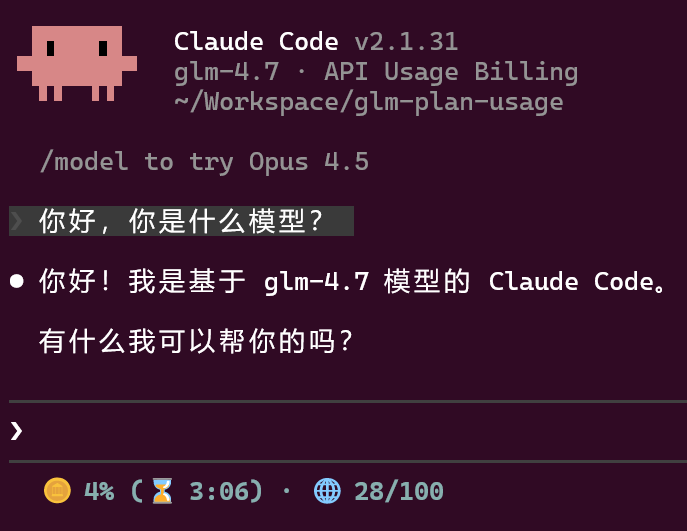

# glm-plan-usage

[English](README_en.md)

一个用于 Claude Code 的状态栏插件，实时显示 GLM（智谱/ZAI）算力套餐的使用量统计。

基于 [jukanntenn/glm-plan-usage](https://github.com/jukanntenn/glm-plan-usage) 修改，增加了调用次数、Token 消耗、周限量等显示功能。



## 功能特性

- **实时使用量追踪**：显示 5 小时 Token 配额使用率、重置时间
- **调用次数统计**：显示 5 小时窗口内的模型调用次数及套餐上限
- **Token 消耗显示**：显示 5 小时窗口内的 Token 消耗总量（智能 K/M 单位）
- **周限量支持**：自动检测并显示周限量（部分套餐有）
- **MCP 配额显示**：显示 30 天 MCP 工具调用次数
- **颜色警告提示**：绿色 (0-79%)、黄色 (80-94%)、红色 (95-100%)
- **自动平台检测**：支持智谱（bigmodel.cn）和 ZAI（api.z.ai），自动适配时区
- **智能模型过滤**：使用非 GLM 模型时自动隐藏用量信息
- **智能缓存**：2 分钟缓存减少 API 调用
- **跨平台支持**：支持 Windows、macOS 和 Linux

## 状态栏显示

### 老套餐（无周限量）

```
🪙 5% (⏰ 23:00) · 📊 93/9000 · 🌐 0/1000 · ⚡ 3.38M
```

### 新套餐（有周限量）

```
🪙 5% (⏰ 23:00) · 📊 93/6000 · 📅 300/30000 · 🌐 0/1000 · ⚡ 3.38M
```

### 各项说明

| 图标 | 含义 | 说明 |
|------|------|------|
| 🪙 | 5 小时 Token 配额 | 使用率百分比 + 重置时间 |
| 📊 | 5 小时调用次数 | 当前调用次数 / 套餐上限 |
| 📅 | 周限量（新套餐） | 当前已用 / 套餐上限 |
| 🌐 | MCP 配额 | 30 天工具调用次数 |
| ⚡ | Token 消耗 | 5 小时窗口内 Token 消耗总量 |

### 配额对照表

#### 老套餐

| 套餐 | 5 小时调用上限 |
|------|---------------|
| Lite | 1,800 |
| Pro | 9,000 |
| Max | 36,000 |

#### 新套餐

| 套餐 | 5 小时调用上限 | 周限额上限 |
|------|---------------|-----------|
| Lite | 1,200 | 6,000 |
| Pro | 6,000 | 30,000 |
| Max | 24,000 | 120,000 |

## 安装

### 方式一：纯 Node.js 实现（推荐）

无需编译，使用 Node.js 内置 HTTPS 模块，自动使用系统证书存储，避免 TLS 兼容性问题。

**Linux/macOS:**

```json
{
  "statusLine": {
    "type": "command",
    "command": "node /path/to/glm-plan-usage-pure.js",
    "padding": 0
  }
}
```

**Windows:**

```json
{
  "statusLine": {
    "type": "command",
    "command": "node C:/Users/你的用户名/.claude/glm-plan-usage/glm-plan-usage-pure.js",
    "padding": 0
  }
}
```

### 方式二：从源码构建

```bash
git clone https://github.com/zwen64657/glm-plan-usage2.git
cd glm-plan-usage2
cargo build --release
```

编译后的可执行文件在 `target/release/glm-plan-usage`（Windows 为 `glm-plan-usage.exe`）。

### 手动安装（Rust 二进制）

将可执行文件放到 Claude Code 的插件目录：

**Linux/macOS:**

```bash
mkdir -p ~/.claude/glm-plan-usage
cp target/release/glm-plan-usage ~/.claude/glm-plan-usage/
chmod +x ~/.claude/glm-plan-usage/glm-plan-usage
```

**Windows:**

```powershell
New-Item -ItemType Directory -Force -Path "$env:USERPROFILE\.claude\glm-plan-usage"
Copy-Item target\release\glm-plan-usage.exe "$env:USERPROFILE\.claude\glm-plan-usage\"
```

## 配置

在 Claude Code 的 `settings.json` 中添加：

**Linux/macOS:**

```json
{
  "statusLine": {
    "type": "command",
    "command": "~/.claude/glm-plan-usage/glm-plan-usage",
    "padding": 0
  }
}
```

**Windows:**

```json
{
  "statusLine": {
    "type": "command",
    "command": "%USERPROFILE%\\.claude\\glm-plan-usage\\glm-plan-usage.exe",
    "padding": 0
  }
}
```

重启 Claude Code 即可生效。插件会自动读取 Claude Code 的 `ANTHROPIC_AUTH_TOKEN` 和 `ANTHROPIC_BASE_URL` 环境变量，无需额外配置。

### 支持的平台

| 平台 | BASE_URL | 时区 |
|------|----------|------|
| 智谱 | `https://open.bigmodel.cn/api/anthropic` | 北京时间 (UTC+8) |
| ZAI | `https://api.z.ai/...` | UTC |

插件根据 `ANTHROPIC_BASE_URL` 自动检测平台并适配时区。

## 与其他状态栏插件组合使用

如果已经在使用 [CCometixLine](https://github.com/Haleclipse/CCometixLine) 等插件，可以创建组合脚本：

**Linux/macOS:** `~/.claude/status-line-combined.sh`

```bash
#!/bin/bash
INPUT=$(cat)
CCLINE_OUTPUT=$(echo "$INPUT" | ~/.claude/ccline/ccline 2>/dev/null)
GLM_OUTPUT=$(echo "$INPUT" | ~/.claude/glm-plan-usage/glm-plan-usage 2>/dev/null)

OUTPUT=""
[ -n "$CCLINE_OUTPUT" ] && OUTPUT="$CCLINE_OUTPUT"
if [ -n "$GLM_OUTPUT" ]; then
    [ -n "$OUTPUT" ] && OUTPUT="$OUTPUT | $GLM_OUTPUT" || OUTPUT="$GLM_OUTPUT"
fi
[ -n "$OUTPUT" ] && printf "%s" "$OUTPUT"
```

```bash
chmod +x ~/.claude/status-line-combined.sh
```

**Windows (PowerShell):** `%USERPROFILE%\.claude\status-line-combined.ps1`

```powershell
$InputString = [Console]::In.ReadToEnd()
$CclineOutput = $InputString | & "$env:USERPROFILE\.claude\ccline\ccline.exe" 2>$null
$GlmOutput = $InputString | & "$env:USERPROFILE\.claude\glm-plan-usage\glm-plan-usage.exe" 2>$null

$Output = ""
if (-not [string]::IsNullOrEmpty($CclineOutput)) { $Output = $CclineOutput }
if (-not [string]::IsNullOrEmpty($GlmOutput)) {
    if (-not [string]::IsNullOrEmpty($Output)) { $Output = "$Output | $GlmOutput" }
    else { $Output = $GlmOutput }
}
if (-not [string]::IsNullOrEmpty($Output)) { Write-Host -NoNewline $Output }
```

然后在 `settings.json` 中指向组合脚本即可。

## 许可证

MIT
